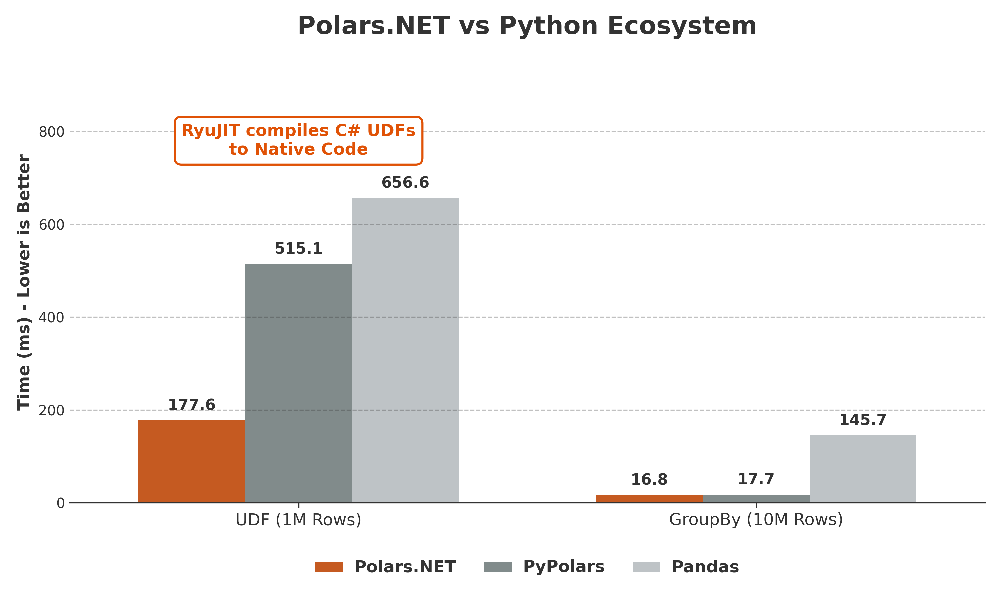
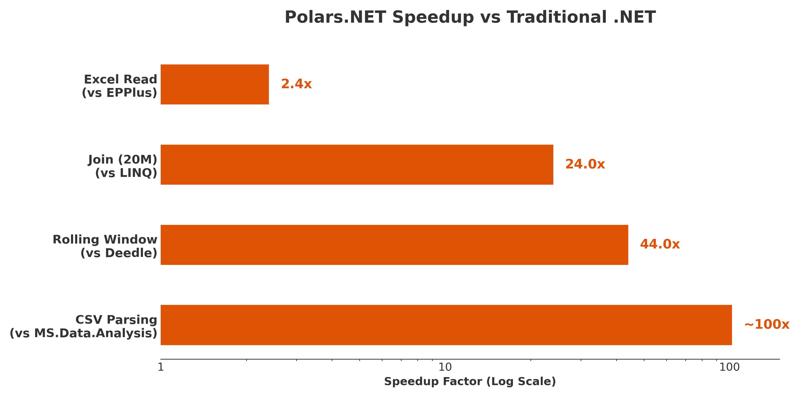

# Polars.NET

[](https://www.nuget.org/packages/Polars.NET)
[](https://www.nuget.org/packages/Polars.NET)
[](https://www.nuget.org/packages/Polars.FSharp)
[](LICENSE)
[](https://errorlsc.github.io/Polars.NET/index.html)

**High-Performance, DataFrame Engine for .NET, powered by Rust & Apache Arrow. With cloud and deltalake features.**


Supported Platforms: Windows (x64), Linux (x64/ARM64, glibc/musl), macOS (ARM64).
Cloud: AWS, Azure and GCP
Data Lake: Delta Lake

## Why Polars.NET exists

This is the game I'd like to play: binding the lightning-fast Polars engine to the .NET ecosystem.
And it brings a lot of fun.

- Polars.NET vs Python Ecosystem

    <picture>
    <source media="(prefers-color-scheme: dark)" srcset="assets/benchmark_python_dark.png">
    
    </picture>

- Speedup vs Legacy .NET

    <picture>
    <source media="(prefers-color-scheme: dark)" srcset="assets/benchmark_summary_dark.png">
    
    </picture>

## Installation

C# Users:

```Bash
dotnet add package Polars.NET 
# And then add the native runtime for your current environment:
dotnet add package Polars.NET.Native.win-x64
```

F# Users:

```Bash
dotnet add package Polars.FSharp
# And then add the native runtime for your current environment:
dotnet add package Polars.NET.Native.win-x64
```

- Requirements: .NET 8+.
- Hardware: CPU with AVX2 support (x86-64-v3). Roughly Intel Haswell (2013+) or AMD Excavator (2015+). If you have AVX-512 supported CPU, please try to compile Rust core on your machine use RUSTFLAGS='-C target-cpu=native'

## Quick Start

### C# Example

```csharp
using Polars.CSharp;
using static Polars.CSharp.Polars; // For Col(), Lit() helpers

// 1. Create a DataFrame
var data = new[] {
    new { Name = "Alice", Age = 25, Dept = "IT" },
    new { Name = "Bob", Age = 30, Dept = "HR" },
    new { Name = "Charlie", Age = 35, Dept = "IT" }
};
var df = DataFrame.From(data);

// 2. Filter & Aggregate
var res = df
    .Filter(Col("Age") > 28)
    .GroupBy("Dept")
    .Agg(
        Col("Age").Mean().Alias("AvgAge"),
        Col("Name").Count().Alias("Count")
    )
    .Sort("AvgAge", descending: true);

// 3. Output
res.Show();
// shape: (2, 3)
// ┌──────┬────────┬───────┐
// │ Dept ┆ AvgAge ┆ Count │
// │ ---  ┆ ---    ┆ ---   │
// │ str  ┆ f64    ┆ u32   │
// ╞══════╪════════╪═══════╡
// │ IT   ┆ 35.0   ┆ 1     │
// │ HR   ┆ 30.0   ┆ 1     │
// └──────┴────────┴───────┘
```

### F# Example

```fsharp

open Polars.FSharp

// 1. Scan CSV (Lazy)
let lf = LazyFrame.ScanCsv "users.csv"

// 2. Transform Pipeline
let res = 
    lf
    |> pl.filterLazy (pl.col "age" .> pl.lit 28)
    |> pl.groupByLazy 
        [ pl.col "dept" ]
        [ 
            pl.col("age").Mean().Alias "AvgAge" 
            pl.col("name").Count().Alias "Count"
        ]
    |> pl.collect
    |> pl.sort ("AvgAge", false)

// 3. Output
res.Show()

```

## Benchmark

- [Benchmark Code](https://github.com/ErrorLSC/Polars.NET-Benchmark)

## Architecture

3-Layer Architecture ensures API stability.

1. Hand-written Rust C ABI layer bridging .NET and Polars. (native_shim)
2. .NET Core layer for dirty works like unsafe ops, wrappers, LibraryImports. (Polars.NET.Core)
3. High level C# and F# API layer here. No unsafe blocks. (Polars.CSharp & Polars.FSharp)

## Roadmap

- Expanded SQL and LINQ Support: Full coverage of Polars SQL capabilities (CTEs, Window Functions) to replace in-memory DataTable SQL queries. LINQ extension is under blueprinting.

- Cloud Support: Direct IO integration with AWS S3, Azure Blob Storage, and Data Lakes. => Done.

- Additional Data Lake Support: Add catalog feature.

- Documentation: [**Docs Here**](https://errorlsc.github.io/Polars.NET/index.html)

## Contributing

Contributions are welcome! Whether it's adding new expression mappings, improving documentation, or optimizing the FFI layer.

1. Fork the repo.

2. Create your feature branch.

3. Submit a Pull Request.

## License

MIT License. See LICENSE for details.
