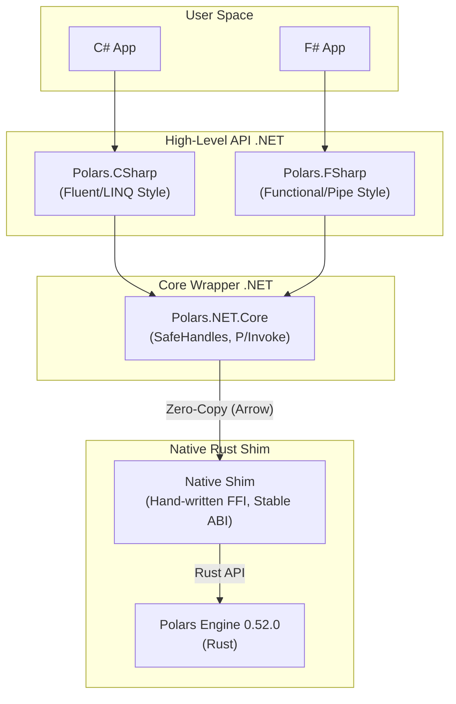

[](https://www.nuget.org/packages/Polars.NET)
[](https://www.nuget.org/packages/Polars.NET)
[](https://www.nuget.org/packages/Polars.FSharp)
[](https://www.nuget.org/packages/Polars.FSharp)
[](LICENSE)

# Polars.NET

🚀 **High-Performance, AI-Ready DataFrames for .NET, powered by Rust & Apache Arrow.**

**Polars.NET** is not just a binding; it is a production-grade data engineering toolkit for the .NET ecosystem. It brings the lightning-fast performance of the Polars Rust engine to C# and F#, while adding unique, enterprise-ready features missing from other solutions—like seamless **Database Streaming**, **Zero-Copy Interop**, and **Safe Native UDFs**.

## Why Polars.NET exists

The .NET ecosystem deserves a first-class, production-grade DataFrame engine —
not a thin wrapper, not a toy binding, and not a Python dependency in disguise.

Polars.NET is designed for engineers who care about:

- **predictable performance** (No GC spikes)

- **strong typing** (Compile-time safety)

- **streaming data at scale** (Constant memory usage)

- **and long-term system evolution** (Stable API)

## 🌟 Key Highlights

### 1. ⚡ Unmatched Performance
- **Rust Core**: Built on the blazing fast Polars query engine (0.52.0+).
- **Lazy Evaluation**: Intelligent query optimizer with predicate pushdown, projection pushdown, and parallel execution.
- **Zero-Copy**: Built on **Apache Arrow**, enabling zero-overhead data transfer between C#, Python (for AI), and Databases.

### 2. 🛡️ Battle-Tested Quality
We take stability seriously. Polars.NET is backed by a rigorous test suite:
- **300+ Unit & Integration Tests**: Covering everything from basic filtering to complex AsOf Joins, SQL Context, and Database Streaming.
- **Memory Safety Checks**: Ensuring no leaks across the Rust/.NET boundary (FFI).
- **Edge Case Coverage**: Null handling, nested structs, and type casting are strictly verified.

### 3. 🧶 .NET Native Experience
- **Fluent API**: Intuitive, LINQ-like API design for C#.
- **Functional API**: Idiomatic, pipe-forward (`|>`) API for F# lovers.
- **Type Safety**: Leveraging .NET's strong type system to prevent runtime errors.

## 🏛️ Architecture

Our unique **3-Layer Architecture** ensures stability even when the underlying Rust engine changes.



## 📦 Installation

C# Users:
```Bash
dotnet add package Polars.NET
```
F# Users:
```Bash
dotnet add package Polars.FSharp
```

Requirements: .NET 8 or later.

## 🏁 Quick Start

### C# Example

```csharp
using Polars.CSharp;
using static Polars.CSharp.Polars; // For Col(), Lit() helpers

// 1. Create a DataFrame
var data = new[] {
    new { Name = "Alice", Age = 25, Dept = "IT" },
    new { Name = "Bob", Age = 30, Dept = "HR" },
    new { Name = "Charlie", Age = 35, Dept = "IT" }
};
using var df = DataFrame.From(data);

// 2. Filter & Aggregate
using var res = df
    .Filter(Col("Age") > 28)
    .GroupBy("Dept")
    .Agg(
        Col("Age").Mean().Alias("AvgAge"),
        Col("Name").Count().Alias("Count")
    )
    .Sort("AvgAge", descending: true);

// 3. Output
res.Show();
```
### F# Example

```fsharp

open Polars.FSharp

// 1. Scan CSV (Lazy)
let lf = LazyFrame.ScanCsv "users.csv"

// 2. Transform Pipeline
let res = 
    lf
    |> pl.filterLazy (pl.col "age" .> pl.lit 28)
    |> pl.groupByLazy 
        [ pl.col "dept" ]
        [ 
            pl.col("age").Mean().Alias "AvgAge" 
            pl.col("name").Count().Alias "Count"
        ]
    |> pl.collect
    |> pl.sort ("AvgAge", false)

// 3. Output
res.Show()

```
## 🔥 Killer Features (The "Missing" Parts)

1. 🌊 Streaming ETL: Database -> Polars -> Database

The Problem: Loading 10 million SQL rows into a DataTable or List<T> explodes memory. 
The Solution: Stream data directly from IDataReader into Polars' core using constant memory.

```csharp
// 1. Source: Stream from Database (e.g., SqlDataReader)
// We scan the DB via a factory, pulling 50k rows at a time into Apache Arrow batches.
var lf = LazyFrame.ScanDb(() => mySqlCommand.ExecuteReader(), batchSize: 50_000);

// 2. Transform: Lazy Evaluation (Rust Engine)
// No data is loaded yet. We are building a query plan.
var pipeline = lf
    .Filter(Col("Region") == Lit("US"))
    .WithColumn((Col("Amount") * 1.08).Alias("TaxedAmount"))
    .Select("OrderId", "TaxedAmount", "OrderDate");

// 3. Sink: Stream back to Database (e.g., SqlBulkCopy)
// We expose the processed stream as an IDataReader implementation!
pipeline.SinkTo((IDataReader reader) => 
{
    // This reader pulls data from the Rust engine on-demand.
    // Perfect for SqlBulkCopy.WriteToServer(reader)
    using var bulk = new SqlBulkCopy(connectionString);
    bulk.DestinationTableName = "ProcessedOrders";
    bulk.WriteToServer(reader);
});
```
```
┌──────────────┐     Arrow Batches     ┌────────────┐
│  Database    │ ───────────────────▶ │ Polars Core│
│ (IDataReader)│                       │   (Rust)   │
└─────▲────────┘ ◀─────────────────── │            │
      │        Zero-Copy Stream        └─────▲──────┘
      │                                      │
      │                                      │ FFI
┌─────┴──────┐                               │
│   .NET API │ ◀────────────────────────────┘
│ (C# / F#)  │
└────────────┘
```

2. 🧠 Native C#/F# UDFs

Run C#/F# functions directly on Expr/Series with Zero-Copy overhead using Apache Arrow memory layout.

```fsharp
// Define logic with Option handling (Safe!)
let complexLogic (opt: int option) =
    match opt with
    | Some x when x % 2 = 0 -> Some (x * 10)
    | _ -> None

let s = Series.create("nums", [Some 1; Some 2; None; Some 4])

// Execute MapOption directly on Series
// No need to convert to C# objects or slow IEnumerable!
let result = s.MapOption(complexLogic, DataType.Int32)

// Result: [null, 20, null, 40]
```

### 3. 🛡️ Deep Type-Safe Schema Inference
**The Problem:** Defining schemas for complex nested JSON-like data is painful and error-prone.
**The Solution:** Polars.NET includes a powerful **Recursive Arrow Converter**. It automatically maps complex .NET object graphs—including Lists, nested objects, and native types like `DateOnly`—directly to Arrow memory.

```csharp
// 1. Define complex nested structures
public class Portfolio
{
    public string User { get; set; }
    public List<Holding> Assets { get; set; } // Nested List!
    public Address Contact { get; set; }      // Nested Struct!
}

public record Holding(string Ticker, decimal Qty, DateOnly Acquired);

// 2. Auto-Inference Magic
// Polars.NET recursively builds the Schema:
// User: Utf8
// Assets: List<Struct<Utf8, Decimal128, Date32>>
// Contact: Struct<...>
using var df = DataFrame.From(GetPortfolios()); 

// 3. Zero friction integration
// No manual mapping. No flattening required.
```

## 🤝 The Polars.NET Promise: Stability First

We know that breaking changes hurt. While the underlying Polars Rust engine evolves rapidly with frequent API changes, Polars.NET works differently.

1. The Native Shim Shield: We maintain a hand-written Rust FFI layer (native_shim) that absorbs upstream breaking changes from Polars.

2. Stable High-Level API: We promise to keep the C# and F# public APIs (DataFrame, Series, LazyFrame) semantically stable. Even if Polars changes its       internal methods (like into_decimal vs primitive_array), we update our shim, so your C# code doesn't have to change.

3. Deprecation Policy: If a breaking change is absolutely necessary, we will mark methods as [Obsolete] for at least one minor version before removal.

## 🗺️ Roadmap & Documentation

We are building the future of data engineering in .NET.

- Expanded SQL Support: Full coverage of Polars SQL capabilities (CTEs, Window Functions) to replace in-memory DataTable SQL queries.

- AI & Tensor Integration: Zero-copy export to .NET 9 Tensors and Microsoft.ML, enabling seamless "Data Prep -> Training/Inference" pipelines.

- LINQ Provider (Long-term): IQueryable implementation to translate standard LINQ queries into high-performance Polars Expressions.

- Documentation: Comprehensive API Reference.

## 🤝 Contributing

Contributions are welcome! Whether it's adding new expression mappings, improving documentation, or optimizing the FFI layer.

1. Fork the repo.

2. Create your feature branch.

3. Submit a Pull Request.

## 📄 License

MIT License. See LICENSE for details.